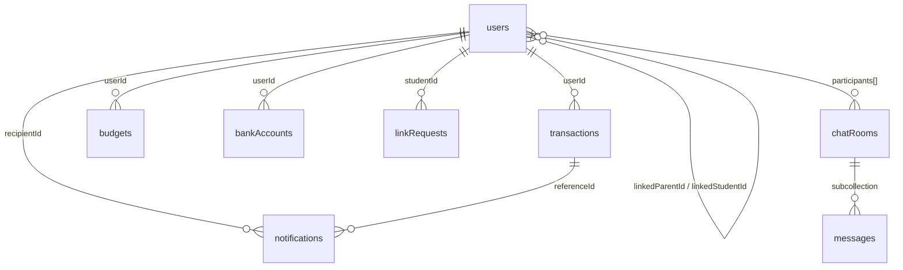

# 🗂️ Firestore Database Schema — SmartSpending (v2)

> Cập nhật từ dữ liệu cứng trong code UI + `SmartSpending_DoAn.md`.
> Có khả năng scale và mở rộng cho: **Bank Linking** + **Chat Parent-Child**.

---

## Tổng quan Collections

| # | Collection | Mục đích | Dùng ở màn hình |
|---|---|---|---|
| 1 | `users` | Thông tin user + role + settings | Home, Setting, Profile |
| 2 | `transactions` | Giao dịch thu/chi | Home, History, Detail, **Statistic** |
| 3 | `budgets` | Ngân sách theo tháng | **Statistic** (phân tích ngân sách) |
| 4 | `linkRequests` | Mã liên kết 6 số (24h TTL) | Link Parent Screen |
| 5 | `notifications` | Thông báo cho Parent | Notification tab (Parent) |
| 6 | `bankAccounts` | 🆕 Liên kết ngân hàng | Setting → Bank Linking |
| 7 | `chatRooms` | 🆕 Phòng chat Parent-Child | Chat tab |
| 8 | `messages` | 🆕 Subcollection tin nhắn | Chat tab |

### 📊 Statistic dùng bảng nào?

> **Statistic = `transactions` + `budgets`**

| Dữ liệu Statistic | Nguồn | Cách tính |
|---|---|---|
| Tổng chi tiêu tháng | `transactions` | `SUM(amount)` WHERE `type="expense"` + filter theo `date` trong tháng |
| Tổng thu nhập tháng | `transactions` | `SUM(amount)` WHERE `type="income"` + filter theo `date` |
| Số dư hiện tại | `transactions` | `totalIncome - totalExpense` (tính trên client) |
| Pie Chart phân bổ | `transactions` | `GROUP BY category` → tính % mỗi category |
| Top 3 danh mục | `transactions` | Sort categories by total amount DESC |
| So sánh tháng trước | `transactions` | Query 2 tháng, tính % thay đổi |
| Phân tích ngân sách | `budgets` | `totalBudget` vs `SUM(expense)` → progress bar |
| Giới hạn theo category | `budgets.categoryLimits` | So sánh với actual spend per category |

---

## Chi tiết từng Collection

### 1. `users/{uid}`

Dữ liệu cứng từ code UI:
- Home Student: `"Đạt Chiến"`, avatar URL, balance `5.000.000đ`, income `2.000.000đ`, expense `1.500.000đ`
- Home Parent: `"Nguyễn Văn An"`, avatar `pravatar.cc`, balance con `2.500.000đ`
- Setting Parent: email `nguyen.van.an@example.com`, push notification toggle, email report toggle

```javascript
{
  // --- Thông tin cơ bản ---
  uid: "uid_abc123",                   // Firebase Auth UID
  email: "nguyen.van.an@example.com",  // ← setting_tab_par.dart
  full_name: "Đạt Chiến",             // ← auth_repository_impl.dart (trước đây: displayName)
  phone: "0912345678",                // ← register screen
  role: "student",                     // "student" | "parent"
  avatar_url: "https://i.pravatar.cc/150?img=11", // ← auth_repository_impl default
  
  // --- Liên kết Parent-Student ---
  linkedParentId: null,                // uid của parent (null nếu chưa liên kết)
  linkedStudentId: null,               // uid của student (dùng cho parent)
  
  // --- Settings ---
  settings: {
    pushNotification: true,            // ← setting_tab_par.dart line 12
    emailReport: false,                // ← setting_tab_par.dart line 13
    balanceVisible: true,              // ← home_tab_stu.dart line 14
  },

  // --- Ví điện tử (khởi tạo khi đăng ký) ---
  wallet: {
    balance: 1000000.0,                // ← auth_repository_impl: 1 triệu VND
    currency: "VND",
    is_locked: false,
  },

  // --- Tài khoản ngân hàng (chỉ parent) ---
  bank_account: {                      // ← auth_repository_impl: chỉ tạo nếu role="parent"
    account_number: "BK-1708xxxxxx",
    bank_balance: 1000000.0,
    is_verified: true,
  },
  
  // --- Metadata ---
  created_at: Timestamp,               // ← auth_repository_impl: FieldValue.serverTimestamp()
  updatedAt: Timestamp,
}
```

---

### 2. `transactions/{transactionId}`

Dữ liệu cứng từ code UI:
- Home: `{emoji:"🍜", title:"Ăn uống", subtitle:"Sáng nay•08:30", amount:"-35.000₫", isIncome:false}`
- Detail: `{emoji:"🍜", category:"Ăn uống", amount:"-50.000đ", time:"21/02/2024-12:30", source:"Tiền mặt", note:"Ăn trưa cùng bạn đại học", location:"Canteen Đại học"}`
- Add: `{type: chi/thu, amount, category:"Di chuyển"+emoji"🚌", date:"2023-10-25", note + AI tự động}`
- History: grouped by date, filter by month

```javascript
{
  transactionId: "tx_001",             // auto-generated

  // --- Ownership ---
  userId: "uid_abc123",                // chủ sở hữu (student)
  
  // --- Dữ liệu giao dịch ---
  amount: 35000,                       // ← number, VND (KHÔNG có dấu chấm)
  type: "expense",                     // "expense" | "income"
                                       // ← add_transaction: "Tiền Chi" / "Tiền Thu"
  category: "food",                    // enum key (xem bảng dưới)
  categoryEmoji: "🍜",                // ← TransactionItem.emoji
  note: "Ăn trưa cùng bạn đại học",   // ← detail_transaction line 124
  
  // --- Nguồn nhập ---
  source: "manual",                    // "manual" | "ocr" | "bank_sync"
  paymentMethod: "cash",               // "cash" | "bank" | "ewallet"
                                       // ← detail: "Tiền mặt"
  receiptImageUrl: null,               // URL ảnh hóa đơn (Firebase Storage)
  
  // --- AI metadata ---
  aiClassified: true,                  // AI đã phân loại?
  aiConfidence: 0.92,                  // Độ tin cậy (0-1)
  userOverridden: false,               // User đã sửa lại danh mục AI?
  
  // --- Vị trí (optional, mở rộng) ---
  location: "Canteen Đại học",         // ← detail_transaction line 176
  
  // --- Timestamps ---
  date: Timestamp,                     // Ngày giao dịch (user chọn)
                                       // ← "21/02/2024 - 12:30"
  createdAt: Timestamp,
  updatedAt: Timestamp,
}
```

**Category enum mapping (từ code UI):**

| Key | Emoji | Label (VN) | Màu UI (Student) | Dùng trong |
|---|---|---|---|---|
| `food` | 🍜/🍔/🍽️/☕ | Ăn uống | `AppTheme.primary` | Home, Statistic, History |
| `transport` | 🚌 | Di chuyển | `#5e8761` | Statistic, Add |
| `study` | 📚/📖 | Học tập | `#E89F29` | Home, History, Statistic |
| `entertainment` | 🎮/🎬 | Giải trí | `purple` | Home, History |
| `shopping` | 🛍️ | Mua sắm | - | (từ DoAn spec) |
| `health` | 💊 | Sức khỏe | - | (từ DoAn spec) |
| `housing` | 🏠 | Sinh hoạt | - | (từ DoAn spec) |
| `other` | 📦 | Khác | `#a3c4a6` | Statistic |
| `income` | 💰/💻/💳 | Thu nhập | `green` | Home (Lương, Mẹ chuyển) |

**Indexes cần tạo:**
```
userId + date (DESC)        → Lịch sử giao dịch theo ngày
userId + type + date        → Filter thu/chi + Statistic tính tổng
userId + category + date    → Statistic pie chart theo danh mục
```

---

### 3. `budgets/{budgetId}`

Dữ liệu cứng từ `statistic_tab_par.dart`:
- Đã dùng: `2.500.000đ / 3.000.000đ`, còn lại `500.000đ`
- Badge: "Trong hạn mức"

```javascript
{
  budgetId: "budget_uid_202503",       // format: budget_{userId}_{YYYYMM}
  userId: "uid_abc123",
  
  // --- Ngân sách ---
  monthYear: "2025-03",               // YYYY-MM
  totalBudget: 3000000,               // ← statistic_tab_par: "3.000.000đ"
  
  // --- Giới hạn theo category (mở rộng) ---
  categoryLimits: {                    
    "food": 1200000,
    "transport": 500000,
  },
  
  // --- Cảnh báo ---
  warningThreshold: 0.8,              // 80%
  warningTriggered: false,
  overBudgetTriggered: false,
  
  // --- Ai set ---
  setBy: "uid_abc123",                // student hoặc parent đều set được
  createdAt: Timestamp,
  updatedAt: Timestamp,
}
```

---

### 4. `linkRequests/{requestId}`

> **Dùng ở đâu?** Màn hình "Liên kết gia đình" (mục 3.4 trong đồ án):
> 1. **Student** mở app → Tạo mã 6 số → Gửi mã cho Parent
> 2. **Parent** mở app → Nhập mã 6 số → Liên kết thành công
> 3. Sau khi liên kết → Parent xem được dashboard con real-time
> 4. Mã hết hạn sau 24h nếu chưa dùng

```javascript
{
  requestId: "req_001",
  code: "482751",                      // 6 chữ số random
  studentId: "uid_abc123",
  expiresAt: Timestamp,                // +24h
  status: "pending",                   // "pending" | "accepted" | "expired"
  acceptedBy: null,                    // uid parent đã dùng mã
  createdAt: Timestamp,
}
```

---

### 5. `notifications/{notificationId}`

```javascript
{
  notificationId: "notif_001",
  recipientId: "uid_xyz",             // Parent nhận
  senderId: "uid_abc123",             // Student (tự động)
  
  type: "large_transaction",           // "large_transaction" | "budget_warning" | "link_request" | "chat_message"
  title: "Chi tiêu lớn",
  message: "Con bạn vừa chi 600.000đ cho Mua sắm",
  
  referenceType: "transaction",        // "transaction" | "budget" | "link" | "chat"
  referenceId: "tx_001",
  
  isRead: false,
  createdAt: Timestamp,
}
```

---

### 6. 🆕 `bankAccounts/{bankAccountId}`

```javascript
{
  bankAccountId: "ba_001",
  userId: "uid_abc123",
  
  bankCode: "VCB",                     // Mã ngân hàng
  bankName: "Vietcombank",
  accountNumber: "****7890",           // Che bớt, mã hóa
  accountName: "NGUYEN VAN A",
  
  status: "verified",                  // "pending" | "verified" | "disconnected"
  linkedAt: Timestamp,
  autoSync: false,
  lastSyncAt: null,
  createdAt: Timestamp,
}
```

---

### 7. 🆕 `chatRooms/{chatRoomId}`

```javascript
{
  chatRoomId: "chat_uid1_uid2",
  participants: ["uid_abc123", "uid_xyz"],
  studentId: "uid_abc123",
  parentId: "uid_xyz",
  
  lastMessage: "Con ơi tiết kiệm nhé",
  lastMessageAt: Timestamp,
  lastMessageBy: "uid_xyz",
  
  unreadCount: {
    "uid_abc123": 2,
    "uid_xyz": 0,
  },
  createdAt: Timestamp,
}
```

### 8. 🆕 `chatRooms/{chatRoomId}/messages/{messageId}`

```javascript
{
  messageId: "msg_001",
  senderId: "uid_xyz",
  
  type: "text",                        // "text" | "image" | "transaction_share"
  text: "Con ơi tháng này chi tiêu hợp lý lắm!",
  imageUrl: null,
  sharedTransactionId: null,
  
  isRead: false,
  createdAt: Timestamp,
}
```

---

## ER Diagram



---

## Chiến lược Scale

| Vấn đề | Giải pháp |
|---|---|
| Transactions quá nhiều | Composite index `userId + date`, pagination `limit(20) + startAfter()` |
| Statistic query nặng | Cache tổng thu/chi theo tháng vào `budgets.cachedTotals` (tính lại khi cần) |
| Chat messages tăng nhanh | Subcollection + pagination, archive tin cũ > 6 tháng |
| Multiple children / parent | Đổi `linkedStudentId` → `linkedStudentIds: []` array |
| linkRequests hết hạn | Firestore TTL trên `expiresAt`, tự xóa document |
